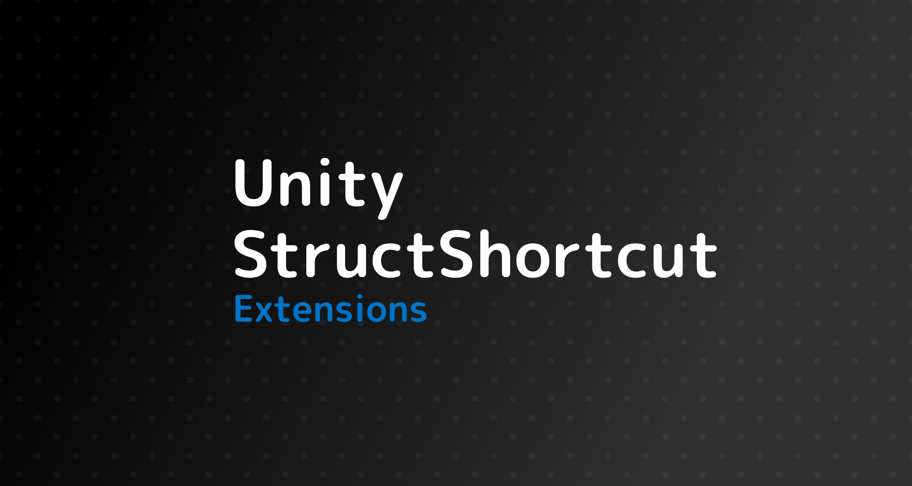

# UnityStructShortcutExtensions



このライブラリはUnityの構造体の操作のショートカットを提供します。

This library provides shortcuts for manipulating Unity structures.

```csharp
// ゲームオブジェクトのXを移動したい時
// When you want to move the X of a game object
Vector3 position = transform.localPosition;
position.x += 1;
transform.localPosition = position
// ↓
transform.AddLocalPos(1);
```


このような代入の繰り返しをショートカットし基本的な操作を簡単化します。

It shortcuts the repetition of such assignments and simplifies basic operations.


### サポートする型/Supported types

| 型/Type                 | プロパティ/Property | 説明/Description                              |
| ----------------------- | ------------------- | --------------------------------------------- |
| Transform               | position            | 広範囲なサポート/Extensive support            |
|                         | localPosition       | 広範囲なサポート/Extensive support            |
|                         | localEulerAngles    | 広範囲なサポート/Extensive support            |
|                         | localScale          | 広範囲なサポート/Extensive support            |
| RectTransformExtensions | sizeDelta           | 部分的なサポート/Partial support              |
|                         | rect                | 部分的なサポート/Partial support              |
|                         | anchoredPosition    | 部分的なサポート/Partial support              |
|                         | pivot               | 部分的なサポート/Partial support              |
|                         | offsetMax           | 部分的なサポート/Partial support              |
|                         | offsetMin           | 部分的なサポート/Partial support              |
| Graphic                 | color               | 必要最小限のサポート/Minimal support required |
| SpriteRenderer          | color               | 必要最小限のサポート/Minimal support required |


## 注意/Attention

サポートする型に大量のメソッドが追加されます。これは非常に煩わしい可能性があります。ライブラリのメソッドは自由に削除可能なので不必要な操作は自身で削除してください。

A lot of methods are added to the supported types. This can be very annoying. Methods in the library can be removed at will, so you can remove unwanted operations yourself.


以上/That's all.


